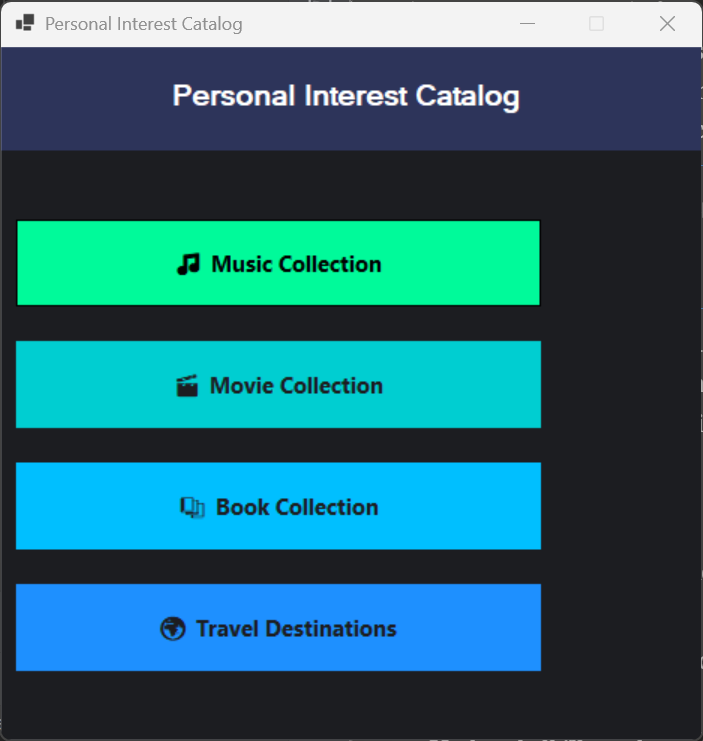
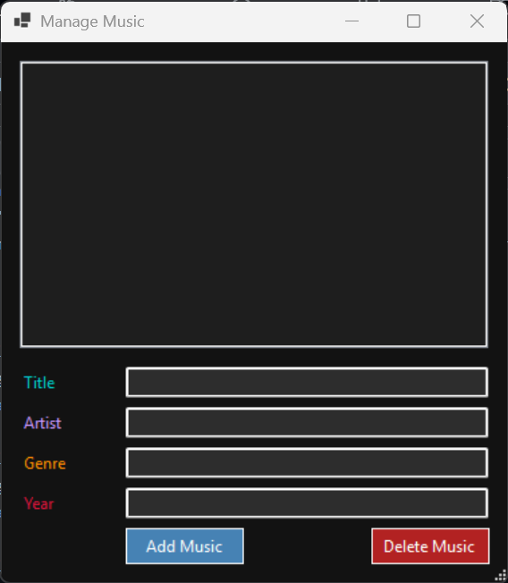
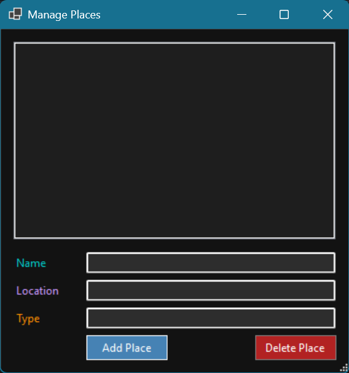

# !dentity

<div align="center">


[](https://dotnet.microsoft.com/)
[](https://docs.microsoft.com/en-us/dotnet/csharp/)
[](https://docs.microsoft.com/en-us/dotnet/desktop/winforms/)
[](https://opensource.org/licenses/MIT)

**A sleek and modern Windows desktop app for organizing your personal interests**

</div>

---

## 🌟 Overview

**!dentity** is a Windows Forms application designed to help users catalog and manage their personal interests in an intuitive, user-friendly interface. Built with C# and .NET Framework 4.8, the app exemplifies:

* 🧱 Clean, maintainable **object-oriented design**
* 🖥️ Smooth and responsive **UI/UX implementation** with WinForms
* 🧠 Efficient, **in-memory data handling** using C# collections and LINQ
* 📐 Strong architectural separation of **models**, **views**, and **services**

This project is ideal for demonstrating your C# desktop development capabilities to potential employers.

---

## ✨ Key Features

* 📚 **Book Tracking** – Record titles, authors, genres, and personal ratings
* 🎬 **Movie Collection** – Organize films by director, genre, and release year
* 🎵 **Music Library** – Catalog your favorite artists, albums, and tracks
* 🌍 **Travel Planner** – Log visited destinations and future travel plans

Additional Highlights:

* 🖱️ **User-Centric Interface** – Simple and intuitive navigation
* ⚡ **Lightweight Performance** – Fast, responsive user experience
* 🧠 **State-Aware Logic** – Keeps session data organized and consistent

---

## 🧪 Technical Overview

### 📁 Project Structure

```
!dentity/
│
├── Forms/                  # UI Components 
│   ├── BookForm.cs         # Interface for managing books
│   ├── MovieForm.cs        # Interface for managing movies
│   ├── MusicForm.cs        # Interface for managing music
│   └── PlaceForm.cs        # Interface for managing travel locations
│
├── Models/                 # Data Models
│   ├── Book.cs             
│   ├── Movie.cs            
│   ├── Music.cs            
│   └── Place.cs            
│
├── Services/               # Business Logic Layer
│   └── DataStore.cs        # In-memory data persistence
│
├── MainForm.cs             # Central navigation interface
├── Program.cs              # Application entry point
└── !dentity.csproj         # Project file
```

### ✅ Skills Demonstrated

* C# 8.0 & Windows Forms development
* Object-oriented design principles
* Separation of concerns & clean architecture
* Event-driven programming
* Efficient data modeling and state management

---

## 📸 Screenshots

<div align="center">

<p><i>Main dashboard – hub for managing all personal interests</i></p>
</div>

<table align="center" style="width:100%; border-spacing: 20px;">
  <tr>
    <td align="center"><br><i>Books Manager</i></td>
    <td align="center"><br><i>Movie Tracker</i></td>
  </tr>
  <tr>
    <td align="center"><br><i>Music Library</i></td>
    <td align="center"><br><i>Travel Planner</i></td>
  </tr>
</table>

---

## 🚀 Getting Started

### Prerequisites

* Windows OS (Windows 10+ recommended)
* [.NET Framework 4.8+](https://dotnet.microsoft.com/download/dotnet-framework/net48)
* [Visual Studio 2019+](https://visualstudio.microsoft.com/)

### Setup Instructions

```bash
git clone https://github.com/Jalpan04/identity.git
cd identity
```

1. Open `!dentity.sln` in Visual Studio
2. Press `F5` to run the project or `Ctrl+Shift+B` to build

---

## 🔮 Roadmap

* 💾 **Persistent Storage** – Add SQL Server or SQLite support
* 🔍 **Full-Text Search** – Quickly filter interests across categories
* 📊 **Interest Analytics** – Charts and stats for your entries
* 📱 **Mobile Companion App** – Cross-platform companion with Xamarin or MAUI

---

## 🛠️ Technical Details

* **IDE**: Visual Studio 2022
* **Language**: C# 8.0
* **Framework**: .NET Framework 4.8
* **UI Library**: Windows Forms

### 🧰 Design Patterns

* **Repository Pattern** – For abstracted data access
* **Factory Pattern** – For modular form instantiation
* **Observer Pattern** – For reactive UI updates

---

## 👨‍💻 About the Developer

This project showcases my commitment to clean architecture, efficient state management, and user-focused application design in C#. I enjoy building reliable software that solves real-world problems elegantly.

---

## 📄 License

Licensed under the [MIT License](LICENSE).

---

<div align="center">
  <a href="https://github.com/Jalpan04">
    
  </a>
  <a href="https://linkedin.com/in/yourprofile">
    
  </a>
</div>


